# CodeSight

**AI-powered code analysis CLI — reviews, bugs, docs, and refactoring from your terminal.**

CodeSight sends your code to LLMs (OpenAI, Anthropic, Google Vertex AI) with structured prompts tuned for code review, bug detection, security analysis, documentation, and refactoring. Multi-provider, configurable, works with any language.

[](https://pypi.org/project/codesight/)
[](https://github.com/AvixoSec/codesight/actions)

[](LICENSE)
[](https://codesight.is-a.dev)
[](https://pypi.org/project/codesight/)
[](https://github.com/astral-sh/ruff)

---

## What it does

- **`codesight review`** — code review with severity-tagged issues (crit/warn/info)
- **`codesight bugs`** — find logic errors, race conditions, resource leaks
- **`codesight security`** — security audit with CWE IDs and OWASP mapping
- **`codesight scan .`** — scan an entire directory with progress bar
- **`codesight docs`** — auto-generate docstrings and module docs
- **`codesight explain`** — plain-language breakdown of complex code
- **`codesight refactor`** — refactoring suggestions with before/after diffs

## Demo

<p align="center">
  
</p>

## Quick Start

```bash
# Install
pip install codesight

# Configure your provider
codesight config

# Run a review
codesight review src/main.py

# Detect bugs
codesight bugs lib/parser.py

# Scan a whole project
codesight scan . --task review
codesight scan src/ --ext .py .js

# Generate docs
codesight docs utils/helpers.py
```

## Provider Support

| Provider | Models | Setup |
|----------|--------|-------|
| **OpenAI** | GPT-5.4, GPT-5.3-Codex | `OPENAI_API_KEY` |
| **Anthropic** | Claude Opus 4.6, Claude Sonnet 4.6 | `ANTHROPIC_API_KEY` |
| **Google Vertex AI** | Gemini 3.1 Pro, Gemini 3.1 Flash | `GOOGLE_CLOUD_PROJECT` + ADC |
| **Ollama (local)** | Llama 3, CodeLlama, Mistral, etc. | Just run `ollama serve` |

## Configuration

CodeSight stores config in `~/.codesight/config.json`. You can configure it interactively:

```bash
codesight config
```

Or set environment variables:

```bash
export OPENAI_API_KEY="sk-..."
export CODESIGHT_MODEL="gpt-5.4"
codesight review my_file.py
```

Switch providers on the fly:

```bash
codesight review my_file.py --provider anthropic
codesight bugs my_file.py --provider google
codesight explain my_file.py --provider openai
codesight review my_file.py --provider ollama  # fully offline, no data leaves your machine
```

## Architecture

```
codesight/
├── __init__.py
├── __main__.py
├── cli.py
├── config.py
├── analyzer.py
└── providers/
    ├── base.py
    ├── factory.py
    ├── openai_provider.py
    ├── anthropic_provider.py
    ├── google_provider.py
    └── ollama_provider.py
```

## Development

```bash
git clone https://github.com/AvixoSec/codesight.git
cd codesight
pip install -e ".[dev]"
pytest tests/ -v
ruff check codesight/
```

## Roadmap

- [x] `codesight scan .` — analyze a whole directory
- [x] Ollama support — fully offline analysis with local models
- [x] `codesight security` — dedicated security audit with CWE IDs and OWASP mapping
- [x] `codesight diff` — review only git-changed files
- [x] SARIF output — standard format for GitHub Security tab
- [x] Exit codes for CI/CD (0 = clean, 1 = warnings, 2 = critical)
- [x] GitHub Action — auto-scan PRs with SARIF upload
- [x] Multi-model pipeline — fast triage + deep verification
- [x] Cost tracking per query
- [x] `codesight benchmark` — test LLMs on vulnerable codebases
- [x] Context compression — code maps to reduce token usage
- [x] Streaming output for large files
- [x] Custom prompt templates
- [x] Publish to PyPI
- [ ] VS Code extension
- [ ] Web dashboard

## License

MIT — see [LICENSE](LICENSE).
